# Aura As-Built ERD Snapshot — 19 September 2026

**Scope:** SQLAlchemy persistence currently present on `main`  
**Base observed during reconciliation:** `1ece91f5e12a29962dedfe6bd9a7a93315ba1b35`  
**Purpose:** record the database/domain structure Aura actually has today, not the original V2 design proposal.

## 1. Architectural rule

Aura does **not** use one giant generic record table.

Current-state domain models remain authoritative for their own workflows, while `VehicleEvent` provides the canonical append-oriented longitudinal progression envelope.

The main relational spine is:

```text
User
 ├─ ClientProfile
 ├─ UserSession
 ├─ CarOwnership ─────────────── Car
 ├─ CarDriver ───────────────── Car
 ├─ ChatMessage                  │
 ├─ ConversationRecord ──────────┤
 ├─ AdvisorNote ─────────────────┤
 └─ ProfileAuditEvent            │
                                 │
Car                              │
 ├─ VehicleProfile               │
 ├─ VehicleDTC ── DiagnosticCodeDefinition
 ├─ VehicleRecall
 ├─ MaintenanceSchedule
 ├─ MileageObservation
 ├─ CarFault / Reported Concern
 ├─ VehicleEvent ── EventAuditLog
 ├─ VehicleHealthSnapshot
 ├─ VehicleHealthAlert
 ├─ Consultation ── VehicleAssessment
 │                    ├─ VehicleAssessmentRisk
 │                    ├─ VehicleAssessmentTreatmentOption
 │                    └─ VehicleAssessmentAddendum
 ├─ TreatmentPlan
 │    ├─ TreatmentAction
 │    └─ TreatmentOutcome
 ├─ PriorityRequest
 └─ VehicleEvidence
      ├─ EvidenceLink
      └─ EvidenceExtraction
```

## 2. Current table catalogue

### Identity, account security and profiles

| Model | Table | Key relationships |
|---|---|---|
| `User` | `users` | root identity for ownership, drivers, advisors, chat, audits and workflow actors |
| `ClientProfile` | `client_profiles` | → `users.id` |
| `ProfileAuditEvent` | `profile_audit_events` | → `users.id` |
| `UserSession` | `user_sessions` | → `users.id` |
| `AccessCode` | `access_code` | → `cars.id`, `users.id` |
| `ClientInvitation` | `client_invitations` | → owner `users.id`, creating advisor `users.id`; hashed single-use activation state |

### Vehicle identity, ownership and driver authority

| Model | Table | Key relationships |
|---|---|---|
| `Car` | `cars` | root vehicle identity |
| `VehicleProfile` | `vehicle_profiles` | → `cars.id`; decoded/enriched identity |
| `CarOwnership` | `car_ownership` | → `users.id`, `cars.id` |
| `CarDriver` | `car_drivers` | → `cars.id`, `users.id` |
| `DriverCheckIn` | `driver_checkins` | → `cars.id`, `users.id` |
| `MileageObservation` | `mileage_observations` | → `cars.id`, `car_ownership.id`, `users.id` |

### Vehicle Intelligence

| Model | Table | Key relationships |
|---|---|---|
| `DiagnosticCodeDefinition` | `diagnostic_code_definitions` | reusable generic/manufacturer DTC definition |
| `VehicleDTC` | `vehicle_dtcs` | → `cars.id`, `diagnostic_code_definitions.id`, `users.id` |
| `VehicleRecall` | `vehicle_recalls` | → `cars.id` |
| `MaintenanceSchedule` | `maintenance_schedules` | → `cars.id` |
| `MaintenanceKnowledgeRule` | `maintenance_knowledge_rules` | optional → `cars.id`; actor → `users.id`; self/version lineage |
| `MaintenanceServiceClassification` | `maintenance_service_classifications` | → `vehicle_events.id`, `cars.id`, `maintenance_knowledge_rules.id`, `users.id`; self/supersession lineage |

### Reported concerns, consultations and assessments

| Model | Table | Key relationships |
|---|---|---|
| `CarFault` | `car_faults` | → `cars.id`, `users.id`; canonical Reported Concern concept under legacy name |
| `Consultation` | `consultations` | → `cars.id`, `car_ownership.id`, `users.id` |
| `VehicleAssessment` | `vehicle_assessments` | → `consultations.id`, `cars.id`, `users.id` |
| `VehicleAssessmentRisk` | `vehicle_assessment_risks` | → `vehicle_assessments.id` |
| `VehicleAssessmentTreatmentOption` | `vehicle_assessment_treatment_options` | → `vehicle_assessments.id` |
| `VehicleAssessmentAddendum` | `vehicle_assessment_addenda` | → `vehicle_assessments.id`, `users.id` |
| `BookingIntent` | `booking_intent` | → `users.id`, `cars.id` |

### Treatment and advisor operations

| Model | Table | Key relationships |
|---|---|---|
| `TreatmentPlan` | `treatment_plans` | → `cars.id`, `consultations.id`, `vehicle_assessments.id`, `users.id`; historical imports may also → `vehicle_evidence.id`, `evidence_extractions.id` |
| `TreatmentAction` | `treatment_actions` | → `treatment_plans.id`, `cars.id`, `users.id` |
| `TreatmentActionCompletionDetail` | `treatment_action_completion_details` | one-to-one → `treatment_actions.id`; optional → `vehicle_evidence.id`, verifier → `users.id` |
| `TreatmentOutcome` | `treatment_outcomes` | → `treatment_plans.id`, `treatment_actions.id`, `cars.id`, `users.id` |
| `AdvisorNote` | `advisor_notes` | → `users.id` client, optional `cars.id`, advisor → `users.id` |
| `PriorityRequest` | `priority_requests` | → `cars.id`, `car_ownership.id`, `users.id`, optional `consultations.id` |

### Canonical events, health and audit

| Model | Table | Key relationships |
|---|---|---|
| `VehicleEvent` | `vehicle_events` | → `cars.id`, `car_ownership.id`, actor → `users.id`, optional parent → `vehicle_events.id` |
| `EventAuditLog` | `event_audit_logs` | → `vehicle_events.id`, `users.id` |
| `VehicleHealthSnapshot` | `vehicle_health_snapshots` | → `cars.id`, `car_ownership.id` |
| `VehicleHealthAlert` | `vehicle_health_alerts` | → `cars.id`, `car_ownership.id`, `users.id` |

### Rina and conversation persistence

| Model | Table | Key relationships / status |
|---|---|---|
| `ChatMessage` | `chat_messages` | → `users.id`; raw conversation turn store |
| `ChatSession` | `chat_sessions` | → `users.id`; compatibility/dormant structure |
| `ConversationRecord` | `conversation_records` | → `users.id`, `cars.id`; durable clinical-style summary |
| `UserMemory` | `user_memory` | → `users.id`; legacy/partial, not approved as universal memory |
| `EscalationLog` | `escalation_logs` | → `users.id` |
| `RinaAIAuditEvent` | `rina_ai_audit_events` | → `users.id`, `cars.id`; governed AI/provider audit |

### Evidence

| Model | Table | Key relationships |
|---|---|---|
| `VehicleEvidence` | `vehicle_evidence` | → `cars.id`, `users.id` |
| `EvidenceLink` | `evidence_links` | → `vehicle_evidence.id`, `cars.id`, `users.id` |
| `EvidenceExtraction` | `evidence_extractions` | → `vehicle_evidence.id`, `users.id`; foundation for controlled extraction work |

## 3. Relationship map

```mermaid
erDiagram
    USER ||--o| CLIENT_PROFILE : has
    USER ||--o{ USER_SESSION : authenticates
    USER ||--o{ PROFILE_AUDIT_EVENT : audited
    USER ||--o{ CLIENT_INVITATION : receives_or_creates
    USER ||--o{ CAR_OWNERSHIP : owns
    USER ||--o{ CAR_DRIVER : drives

    CAR ||--o| VEHICLE_PROFILE : enriched_by
    CAR ||--o{ CAR_OWNERSHIP : stewarded_by
    CAR ||--o{ CAR_DRIVER : assigned_to
    CAR ||--o{ MILEAGE_OBSERVATION : observed_at

    DIAGNOSTIC_CODE_DEFINITION ||--o{ VEHICLE_DTC : defines
    CAR ||--o{ VEHICLE_DTC : reports
    CAR ||--o{ VEHICLE_RECALL : has
    CAR ||--o{ MAINTENANCE_SCHEDULE : schedules
    CAR ||--o{ MAINTENANCE_KNOWLEDGE_RULE : may_override
    CAR ||--o{ MAINTENANCE_SERVICE_CLASSIFICATION : classifies

    CAR ||--o{ CAR_FAULT : reports
    CAR ||--o{ CONSULTATION : receives
    CONSULTATION ||--o| VEHICLE_ASSESSMENT : may_create
    VEHICLE_ASSESSMENT ||--o{ VEHICLE_ASSESSMENT_RISK : contains
    VEHICLE_ASSESSMENT ||--o{ VEHICLE_ASSESSMENT_TREATMENT_OPTION : proposes
    VEHICLE_ASSESSMENT ||--o{ VEHICLE_ASSESSMENT_ADDENDUM : corrected_by

    CAR ||--o{ TREATMENT_PLAN : managed_by
    CONSULTATION ||--o{ TREATMENT_PLAN : informs
    VEHICLE_ASSESSMENT ||--o{ TREATMENT_PLAN : informs
    TREATMENT_PLAN ||--o{ TREATMENT_ACTION : contains
    TREATMENT_ACTION ||--o| TREATMENT_ACTION_COMPLETION_DETAIL : completion_metadata
    TREATMENT_PLAN ||--o{ TREATMENT_OUTCOME : records
    TREATMENT_ACTION ||--o{ TREATMENT_OUTCOME : may_produce

    CAR ||--o{ PRIORITY_REQUEST : receives
    CONSULTATION ||--o{ PRIORITY_REQUEST : may_link

    CAR ||--o{ VEHICLE_EVENT : has
    VEHICLE_EVENT ||--o{ EVENT_AUDIT_LOG : audited_by
    VEHICLE_EVENT ||--o{ MAINTENANCE_SERVICE_CLASSIFICATION : classified_as

    CAR ||--o{ VEHICLE_HEALTH_SNAPSHOT : snapshots
    CAR ||--o{ VEHICLE_HEALTH_ALERT : signals

    USER ||--o{ CHAT_MESSAGE : sends
    USER ||--o{ CONVERSATION_RECORD : summarized_for
    CAR ||--o{ CONVERSATION_RECORD : scoped_to
    USER ||--o{ ADVISOR_NOTE : relates_to
    CAR ||--o{ ADVISOR_NOTE : may_scope

    CAR ||--o{ VEHICLE_EVIDENCE : supports
    VEHICLE_EVIDENCE ||--o{ EVIDENCE_LINK : links
    VEHICLE_EVIDENCE ||--o{ EVIDENCE_EXTRACTION : may_extract

    USER ||--o{ RINA_AI_AUDIT_EVENT : invokes
    CAR ||--o{ RINA_AI_AUDIT_EVENT : scoped_to
```



## 4. Canonical ownership boundaries

### Current state

The domain table owns the current state:

- Consultation state → `Consultation`
- Assessment state → `VehicleAssessment`
- Treatment progression → `TreatmentPlan` / `TreatmentAction`
- Priority workflow → `PriorityRequest`
- Care-signal lifecycle → `VehicleHealthAlert`
- Current verified odometer projection → `Car.current_mileage` backed by `MileageObservation`
- Evidence review state → `VehicleEvidence`
- Historical document extraction state → `EvidenceExtraction`; provider output remains candidate evidence
- Completed intervention metadata → `TreatmentActionCompletionDetail` attached to a completed `TreatmentAction`

### Longitudinal progression

`VehicleEvent` owns append-oriented history for governed state changes.

A canonical event should point to a durable domain subject and must not be created merely because a score, projection or AI interpretation changed at read time.

## 5. Important compatibility names

Several names are intentionally retained to avoid destructive churn:

- `CarFault` / `car_faults` = Reported Concern concept.
- `car_ownership` uses a singular table name.
- `booking_intent` uses a singular table name.
- `UserMemory` and `ChatSession` remain present but are not approved as the foundation for new memory architecture.
- legacy snapshot fields on `VehicleDTC` remain compatibility data until a verified removal path exists.

Do not create duplicate replacement models merely to improve naming.

## 6. Current structural gaps

This snapshot does not imply every desired domain exists.

Not yet represented as production-complete canonical models:

- full subscription/billing ledger;
- TSB knowledge;
- warranty profile;
- licensed OEM repair-procedure library;
- unified outbound communication delivery-attempt/webhook ledger;
- production predictive-health result/model registry;
- distinct advisor versus administrator account roles.

Those should be added only through explicit product/architecture review, not by modifying this ERD casually.

## 7. Change rule

When a future migration changes this persistence map, update this snapshot or replace it with a dated successor.

The old design ERD under `scripts/document structure/aura_ERD.md` remains historical product architecture and must not be treated as a literal description of the production schema.
